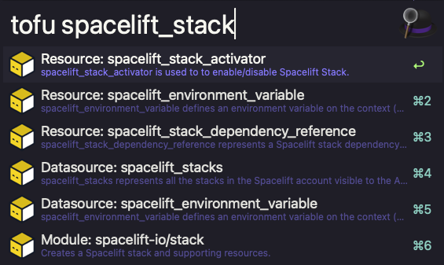

# OpenTofu Alfred Workflow
Search the OpenTofu registry with alfred

## Installation

1. Download the latest release [here](https://github.com/Apollorion/opentofu-alfred/raw/refs/heads/main/opentofu_alfred.alfredworkflow)
2. Double Click and install into alfred.

## Usage

Just use the `tofu` command followed by your query to search the OpenTofu registry.

